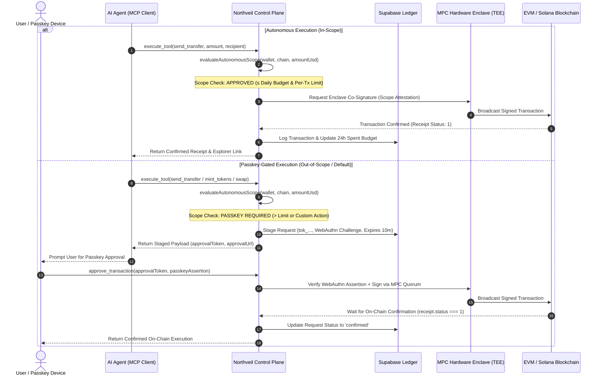

# Northveil Non-Custodial MPC Control-Plane & Cryptography Specification

## 1. Architecture Paradigm: Non-Custodial Hardware-Isolated TEE MPC

Northveil operates strictly on a **Non-Custodial Multi-Party Computation (MPC) Control-Plane Model** powered by hardware-isolated **AWS Nitro Enclaves (TEE)**.

### Core Security Invariants
1. **Zero Raw Private Key Storage**: No unencrypted or reconstructable private key, seed phrase, or mnemonic material is ever stored, written to disk, cached in memory, or retained on Northveil servers or Supabase databases.
2. **Hardware Threshold Secret Sharing**: Private keys are generated directly inside hardware-isolated secure enclaves and split into distributed threshold key shares ($k$-of-$n$ MPC). No single party or server ever possesses the full signing key.
3. **Passkey-Gated Authorization (WebAuthn / FIDO2)**: User client devices authorize transactions via hardware biometric passkeys (Touch ID, Face ID, Windows Hello, YubiKey). Staged transaction payloads require cryptographically valid WebAuthn assertions before MPC enclave co-signing.
4. **Autonomous Agent Spending Scopes**: AI agents operate within user-defined autonomous spending policies (`autonomous_spending_scopes`) enforced at the enclave control plane. Any transaction exceeding the maximum per-transaction USD limit or 24-hour rolling budget is halted and staged for human passkey approval.
5. **Emergency Kill Switch**: Users can activate an instant kill switch (`activate_kill_switch`) that invalidates all outstanding approval tokens and revokes all autonomous agent permissions.

---

## 2. Transaction Lifecycle & Security States



---

## 3. Database Schema (Non-Custodial Architecture)

### 3.1 `public.wallets`
```sql
CREATE TABLE public.wallets (
    id UUID PRIMARY KEY DEFAULT gen_random_uuid(),
    user_id TEXT NOT NULL,
    address TEXT NOT NULL UNIQUE,
    chain_id TEXT NOT NULL DEFAULT 'ethereum',
    name TEXT NOT NULL DEFAULT 'Northveil MPC Vault',
    mpc_provider TEXT NOT NULL DEFAULT 'turnkey', -- 'turnkey' | 'webauthn_mpc'
    mpc_wallet_id TEXT,                          -- Enclave Vault Reference ID
    mpc_sub_org_id TEXT,                        -- TEE Sub-Organization ID
    key_type TEXT NOT NULL DEFAULT 'secp256k1',
    wallet_status TEXT NOT NULL DEFAULT 'active',
    created_at TIMESTAMPTZ NOT NULL DEFAULT NOW(),
    updated_at TIMESTAMPTZ NOT NULL DEFAULT NOW()
);
```

> **Note**: Legacy columns (`encrypted_credential`, `iv`, `auth_tag`, `salt`, `private_key`, `seed_phrase`) are completely dropped from the production schema.

### 3.2 `public.passkey_credentials`
Stores WebAuthn public keys for biometric signature verification:
```sql
CREATE TABLE public.passkey_credentials (
    id UUID PRIMARY KEY DEFAULT gen_random_uuid(),
    user_id TEXT NOT NULL,
    wallet_address TEXT NOT NULL REFERENCES public.wallets(address) ON DELETE CASCADE,
    credential_id TEXT NOT NULL UNIQUE,
    public_key_spki TEXT NOT NULL,
    counter BIGINT NOT NULL DEFAULT 0,
    transports JSONB NOT NULL DEFAULT '["internal", "hybrid"]'::jsonb,
    created_at TIMESTAMPTZ NOT NULL DEFAULT NOW()
);
```

### 3.3 `public.autonomous_spending_scopes`
Enforces rate limits and policy boundaries for autonomous AI operations:
```sql
CREATE TABLE public.autonomous_spending_scopes (
    id UUID PRIMARY KEY DEFAULT gen_random_uuid(),
    user_id TEXT NOT NULL,
    wallet_address TEXT NOT NULL,
    asset TEXT NOT NULL DEFAULT 'ANY',
    allowed_chains JSONB NOT NULL DEFAULT '[1, 8453, 11155111, 137, 42161]'::jsonb,
    max_amount_per_tx_usd NUMERIC(18, 4) NOT NULL DEFAULT 25.0000,
    max_daily_budget_usd NUMERIC(18, 4) NOT NULL DEFAULT 100.0000,
    spent_last_24h_usd NUMERIC(18, 4) NOT NULL DEFAULT 0.0000,
    is_active BOOLEAN NOT NULL DEFAULT TRUE,
    expires_at TIMESTAMPTZ NOT NULL,
    created_at TIMESTAMPTZ NOT NULL DEFAULT NOW()
);
```

### 3.4 `public.kill_switch_records`
Emergency lockout audit ledger:
```sql
CREATE TABLE public.kill_switch_records (
    id UUID PRIMARY KEY DEFAULT gen_random_uuid(),
    wallet_address TEXT NOT NULL,
    user_id TEXT NOT NULL,
    reason TEXT,
    activated_at TIMESTAMPTZ NOT NULL DEFAULT NOW(),
    deactivated_at TIMESTAMPTZ
);
```

---

## 4. Legacy Custodial to Non-Custodial Migration Runbook

For existing systems running legacy versions of Northveil:

1. **Execute Supabase Migration**:
   Run `supabase/migrations/20260825000000_non_custodial_mpc_architecture.sql` to drop encrypted private key columns and provision MPC control tables.
2. **Client Key Migration / Vault Re-generation**:
   Users invoke `create_wallet` to generate fresh hardware-isolated MPC vaults or register their existing public address via `import_wallet`.
3. **Register WebAuthn Passkeys**:
   Client browsers register a WebAuthn device passkey via `/ui/widget` to enable biometric transaction authorizations.
4. **Configure Autonomous Policies**:
   Call `set_autonomous_scope` with desired daily spending budgets and per-tx limits for agent autonomy.

---

## 5. Security & Threat Model FAQ

**Q: Can a Northveil database breach or server compromise leak user funds?**  
**A:** No. Northveil servers and databases never hold private keys or decryptable key material. Even in the event of a full server compromise, attackers cannot sign transactions or move funds.

**Q: What happens if an AI agent goes rogue or is prompted to drain a wallet?**  
**A:** The autonomous spending scope strictly caps losses to the user's daily budget (e.g. $100). Any transaction outside policy requires physical biometric passkey confirmation on the user's device. The emergency kill switch immediately stops all operations.
