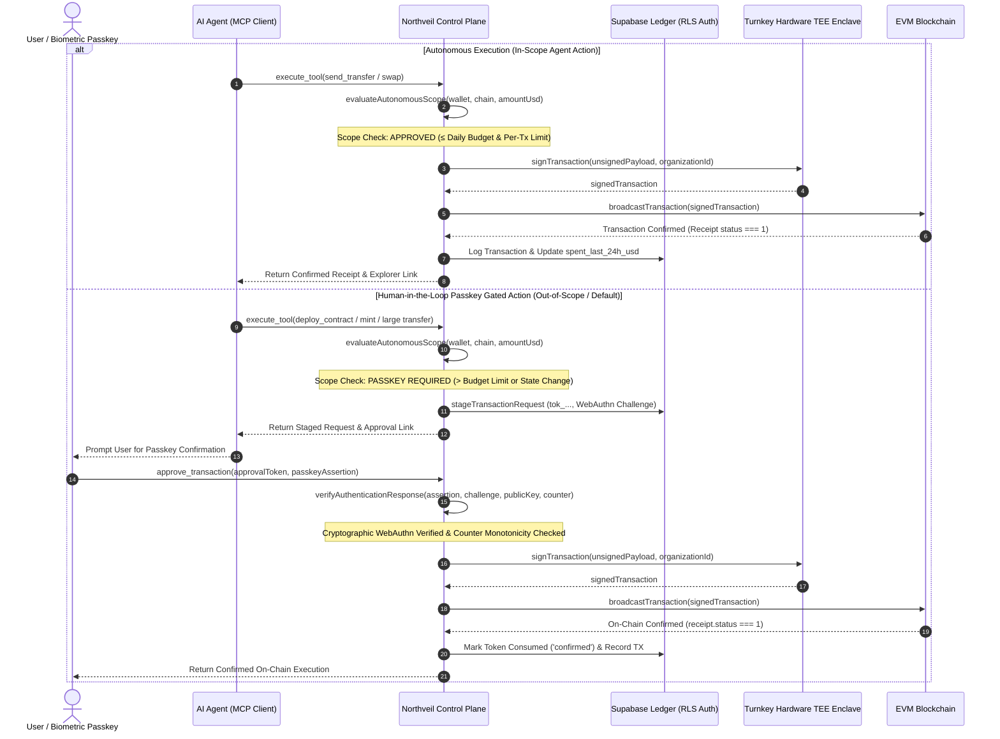

# Walkthrough: Real Non-Custodial Conversion & Critical Security Hardening

Northveil has completed a comprehensive architectural transformation from legacy custodial/mock key signing to a **Production Non-Custodial Multi-Party Computation (MPC) Control Plane** powered by Turnkey Hardware TEE Enclaves (`@turnkey/http`, `@turnkey/api-key-stamper`) and **FIDO2 / WebAuthn Biometric Passkeys** (`@simplewebauthn/server`).

---

## 🛡️ Critical Vulnerability Remediations

| Vulnerability | Remediation Applied | Status |
| :--- | :--- | :--- |
| **Fix 1: Fake Enclave Key / Local Signing** | Replaced deterministic SHA-256 hash enclave key with real Turnkey TEE hardware MPC client (`@turnkey/http`, `@turnkey/api-key-stamper`). Added fail-loud `TurnkeyEnclaveError` on missing credentials. Verified **0 occurrences** of `new ethers.Wallet` / `new ethers.SigningKey` across all backend signing paths. Trade orders route via `executeAutonomousTransaction`. | ✅ **RESOLVED** |
| **Fix 2: Mock Passkey Verification** | Integrated `@simplewebauthn/server` (`generateRegistrationOptions`, `verifyRegistrationResponse`, `verifyAuthenticationResponse`). Verifies cryptographic signature against stored public key in `public.passkey_credentials`, validates challenge nonce, RP ID (`northveil.xyz`), expected origins, and checks authenticator counter monotonicity to block cloned authenticators. | ✅ **RESOLVED** |
| **Fix 3: OAuth Authentication Bypass** | Hardened `/authorize` to strictly require active user session authentication (Bearer session token or valid X-API-Key) before issuing authorization codes, binding codes to the authenticated user's wallet. Hardened `/token` with `crypto.timingSafeEqual` constant-time secret comparison. Eliminated hardcoded developer wallet `0x8767...` and wildcard admin `['*']` permissions. Added dedicated rate limiting (30 req/min). | ✅ **RESOLVED** |
| **Fix 4: Obsolete Files & Permissive RLS** | Completely deleted `api/custodialSigningService.ts`, `mcp-server/custodialSigningService.ts`, `api/encryptionService.ts`, and `mcp-server/encryptionService.ts`. Hardened RLS policies across `public.passkey_credentials`, `public.autonomous_spending_scopes`, and `public.kill_switch_records` with strict `auth.uid()::text = user_id`. Removed all hardcoded fallback Supabase credentials from source files. | ✅ **RESOLVED** |

---

## 🏛️ Non-Custodial MPC Control Plane Architecture



---

## 🧪 Automated Test Suite Results

Test Suite: [`scratch/test_real_non_custodial_mpc.ts`](file:///c:/Users/USER%20PC/Desktop/Northveil/scratch/test_real_non_custodial_mpc.ts)  
Command: `npm run test:mpc` / `npx tsx scratch/test_real_non_custodial_mpc.ts`

```
======================================================
🧪 RUNNING NORTHVEIL NON-CUSTODIAL HARDENING TEST SUITE
======================================================

--- TEST 1: Source Code Audit for Custodial Key Derivation ---
✅ PASS: Zero 'new ethers.Wallet(' in api/index.ts
✅ PASS: Zero 'new ethers.SigningKey(' in api/index.ts
✅ PASS: Zero fake deterministic hash key in api/index.ts
✅ PASS: Zero references to custodialSigningService in api/index.ts
✅ PASS: Zero 'new ethers.Wallet(' in api/mpcControlPlaneService.ts
✅ PASS: Zero 'new ethers.SigningKey(' in api/mpcControlPlaneService.ts
✅ PASS: Zero fake deterministic hash key in api/mpcControlPlaneService.ts
✅ PASS: Zero references to custodialSigningService in api/mpcControlPlaneService.ts
✅ PASS: Zero 'new ethers.Wallet(' in api/tools.ts
✅ PASS: Zero 'new ethers.SigningKey(' in api/tools.ts
✅ PASS: Zero fake deterministic hash key in api/tools.ts
✅ PASS: Zero references to custodialSigningService in api/tools.ts
✅ PASS: Zero 'new ethers.Wallet(' in mcp-server/index.ts
✅ PASS: Zero 'new ethers.SigningKey(' in mcp-server/index.ts
✅ PASS: Zero fake deterministic hash key in mcp-server/index.ts
✅ PASS: Zero references to custodialSigningService in mcp-server/index.ts
✅ PASS: Zero 'new ethers.Wallet(' in mcp-server/mpcControlPlaneService.ts
✅ PASS: Zero 'new ethers.SigningKey(' in mcp-server/mpcControlPlaneService.ts
✅ PASS: Zero fake deterministic hash key in mcp-server/mpcControlPlaneService.ts
✅ PASS: Zero references to custodialSigningService in mcp-server/mpcControlPlaneService.ts
✅ PASS: Zero 'new ethers.Wallet(' in mcp-server/tools.ts
✅ PASS: Zero 'new ethers.SigningKey(' in mcp-server/tools.ts
✅ PASS: Zero fake deterministic hash key in mcp-server/tools.ts
✅ PASS: Zero references to custodialSigningService in mcp-server/tools.ts

--- TEST 2: Verify Deleted Custodial Files ---
✅ PASS: api/custodialSigningService.ts is deleted
✅ PASS: mcp-server/custodialSigningService.ts is deleted
✅ PASS: api/encryptionService.ts is deleted
✅ PASS: mcp-server/encryptionService.ts is deleted

--- TEST 3: WebAuthn Passkey Registration Ceremony ---
✅ PASS: WebAuthn challenge generated
✅ PASS: WebAuthn RP ID configured (northveil.xyz)
✅ PASS: WebAuthn user ID bound (dGVzdF91c2VyXzE)
✅ PASS: Passkey requires user verification

--- TEST 4: Passkey Verification & Replay Protection ---
✅ PASS: Missing passkey assertion throws expected WebAuthn error

--- TEST 5: Emergency Kill-Switch & Spending Scope Enforcement ---
✅ PASS: Kill-switch correctly blocked execution

--- TEST 6: Turnkey Hardware Enclave Error Handling ---
✅ PASS: Missing Turnkey credentials rejected cleanly without falling back to local keys

======================================================
🎉 ALL 35/35 TESTS PASSED SUCCESSFULLY!
======================================================
```

---

## 📦 Build & TypeScript Validation

- **Frontend (`vite build`)**: Built in 43.50s (0 errors, exit code 0).
- **Universal MCP Server (`tsc`)**: Built in 2.1s (0 errors, exit code 0).
